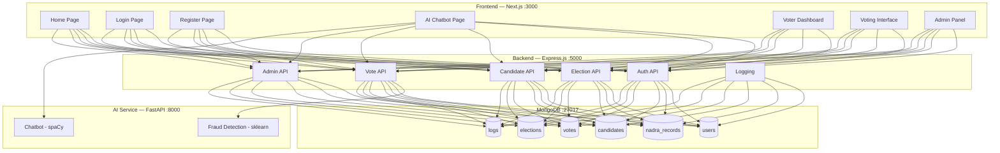

# AI-Based Secure E-Voting System — Implementation Plan

## Overview

Build a full-stack e-voting system with **React (Next.js)** frontend, **Node.js/Express** backend, **Python/FastAPI** AI service, and **MongoDB** database. The system is designed for a university FYP with simulated NADRA verification, fraud detection AI, and NLP chatbot.

## Architecture



---

## Folder Structure

```
d:\FYP 2\
├── frontend/              # Next.js app
│   └── src/
│       ├── app/           # Pages (App Router)
│       │   ├── page.js           # Home
│       │   ├── login/page.js
│       │   ├── register/page.js
│       │   ├── chatbot/page.js
│       │   ├── dashboard/page.js
│       │   ├── vote/[id]/page.js
│       │   └── admin/
│       │       ├── page.js         # Admin dashboard
│       │       ├── elections/page.js
│       │       ├── candidates/page.js
│       │       ├── voters/page.js
│       │       └── monitoring/page.js
│       ├── components/    # Reusable UI components
│       └── lib/           # API utilities, auth context
├── backend/               # Express.js API
│   ├── server.js
│   ├── config/            # DB config, env
│   ├── models/            # Mongoose schemas
│   ├── routes/            # API routes
│   ├── middleware/        # Auth, rate limit, validation
│   ├── controllers/       # Business logic
│   └── seed.js            # Seed 100 NADRA records
├── ai-service/            # Python FastAPI
│   ├── main.py
│   ├── chatbot.py         # spaCy NLP chatbot
│   ├── fraud_detector.py  # sklearn fraud detection
│   └── requirements.txt
├── models/                # Trained ML model file
│   └── fraud_detection_model.pkl
├── database/              # DB scripts & docs
│   └── seed.js
└── README.md
```

---

## Proposed Changes

### Database Layer

#### [NEW] `backend/models/User.js`
Mongoose schema: `name`, `cnic`, `phone`, `password (hashed)`, `role (voter|admin)`, `isVerified`, `otpCode`, `otpExpiry`, `createdAt`

#### [NEW] `backend/models/NadraRecord.js`
Schema: `name`, `cnic`, `age`, `constituency`, `citizen (boolean)`

#### [NEW] `backend/models/Candidate.js`
Schema: `name`, `partyName`, `symbol (image URL)`, `electionType`, `constituency`, `election (ref)`

#### [NEW] `backend/models/Election.js`
Schema: `title`, `type`, `startDate`, `endDate`, `status (upcoming|active|completed)`, `constituencies[]`

#### [NEW] `backend/models/Vote.js`
Schema: `voter (ref)`, `election (ref)`, `candidate (ref)`, `timestamp`, `ipAddress`

#### [NEW] `backend/models/Log.js`
Schema: `userId`, `action`, `details`, `ipAddress`, `timestamp`

#### [NEW] `database/seed.js`
Seeds 100 dummy NADRA records with Pakistani names, valid CNIC formats, ages 16–80, constituencies like NA-1 to NA-272, citizenship flags.

---

### Backend — Express.js API

#### [NEW] `backend/server.js`
Entry point. Sets up Express, connects MongoDB, applies middleware (CORS, helmet, rate-limiter, JSON parser, morgan logger), mounts routes.

#### [NEW] `backend/config/db.js`
MongoDB connection (`mongodb://localhost:27017/evoting`)

#### [NEW] `backend/middleware/auth.js`
JWT verification middleware. Extracts token from `Authorization: Bearer <token>`. Attaches `req.user`.

#### [NEW] `backend/middleware/adminAuth.js`
Extends auth middleware — checks `role === 'admin'`.

#### [NEW] `backend/routes/auth.js`
| Method | Route | Description |
|--------|-------|-------------|
| POST | `/api/auth/register` | Register + NADRA check |
| POST | `/api/auth/verify-otp` | Verify OTP |
| POST | `/api/auth/login` | Login → JWT |
| GET | `/api/auth/me` | Get current user |

**Registration Flow:**
1. Check CNIC in `nadra_records`
2. If not found → reject
3. If age < 18 → reject
4. If already registered → reject
5. Hash password, generate OTP, create user

#### [NEW] `backend/routes/elections.js`
| Method | Route | Description |
|--------|-------|-------------|
| GET | `/api/elections` | List elections |
| GET | `/api/elections/:id` | Get single election |
| POST | `/api/elections` | Create (admin) |
| PUT | `/api/elections/:id` | Update (admin) |
| PUT | `/api/elections/:id/start` | Start election (admin) |
| PUT | `/api/elections/:id/end` | End election (admin) |

#### [NEW] `backend/routes/candidates.js`
| Method | Route | Description |
|--------|-------|-------------|
| GET | `/api/candidates` | List candidates |
| POST | `/api/candidates` | Add (admin) |
| PUT | `/api/candidates/:id` | Update (admin) |
| DELETE | `/api/candidates/:id` | Delete (admin) |

#### [NEW] `backend/routes/votes.js`
| Method | Route | Description |
|--------|-------|-------------|
| POST | `/api/votes` | Cast vote (calls AI fraud-check first) |
| GET | `/api/votes/history` | User vote history |
| GET | `/api/votes/stats` | Admin vote stats |

**Voting Flow:**
1. Verify user authenticated
2. Check user hasn't voted in this election
3. Call `POST http://localhost:8000/fraud-check` with user behavior data
4. If flagged → reject + log alert
5. Record vote + log action

#### [NEW] `backend/routes/admin.js`
| Method | Route | Description |
|--------|-------|-------------|
| GET | `/api/admin/dashboard` | Total voters, votes, elections, alerts |
| GET | `/api/admin/voters` | List all voters |
| GET | `/api/admin/logs` | System logs |
| GET | `/api/admin/alerts` | Fraud alerts |

---

### AI Service — FastAPI

#### [NEW] `ai-service/main.py`
FastAPI app at port 8000 with CORS. Mounts chatbot and fraud routes.

#### [NEW] `ai-service/chatbot.py`
spaCy-based NLP chatbot. Processes user questions about voting, registration, and elections. Uses keyword matching and intent classification.

#### [NEW] `ai-service/fraud_detector.py`
Loads `fraud_detection_model.pkl`. Provides `POST /fraud-check` that accepts:
```json
{
  "login_attempts": 3,
  "time_since_last_login": 120,
  "vote_speed": 5.2,
  "ip_changes": 1,
  "session_duration": 300
}
```
Returns `{ "is_suspicious": false, "confidence": 0.12 }`

#### [NEW] `ai-service/train_model.py`
Script to generate synthetic training data and train a RandomForest fraud detection model. Saves to `models/fraud_detection_model.pkl`.

#### [NEW] `ai-service/requirements.txt`
```
fastapi
uvicorn
spacy
scikit-learn
joblib
numpy
pydantic
```

---

### Frontend — Next.js

#### Design System
- **Primary**: `#16a34a` (green-600)
- **Secondary**: `#ffffff` (white)
- **Dark mode**: `#0f172a` (slate-900) background with `#1e293b` cards
- **Font**: Inter from Google Fonts
- **Animations**: CSS transitions + keyframe animations

#### [NEW] `frontend/src/lib/api.js`
Axios wrapper configured with base URL `http://localhost:5000/api`

#### [NEW] `frontend/src/lib/AuthContext.js`
React context for JWT auth, login/logout/register functions, user state

#### [NEW] `frontend/src/components/`
- `Navbar.js` — responsive nav with dark mode toggle
- `Footer.js` — site footer
- `ThemeToggle.js` — dark/light switch
- `CandidateCard.js` — card with symbol, name, party
- `VoteModal.js` — confirmation modal
- `StatsCard.js` — dashboard stat card
- `Sidebar.js` — admin sidebar navigation
- `ChatWidget.js` — chat message bubble UI
- `ElectionCard.js` — election display card

#### Pages

| Route | Component | Description |
|-------|-----------|-------------|
| `/` | Home | Hero, features, how-it-works |
| `/login` | Login | CNIC + password login |
| `/register` | Register | Full registration + NADRA check |
| `/chatbot` | Chatbot | AI help chatbot |
| `/dashboard` | Dashboard | Voter dashboard (protected) |
| `/vote/[id]` | Vote | Voting interface (protected) |
| `/admin` | Admin Dashboard | Stats overview (admin) |
| `/admin/elections` | Elections | Election CRUD (admin) |
| `/admin/candidates` | Candidates | Candidate CRUD (admin) |
| `/admin/voters` | Voters | Voter list (admin) |
| `/admin/monitoring` | Monitoring | Fraud alerts + logs (admin) |

---

## Security Implementation

| Feature | Implementation |
|---------|---------------|
| Authentication | JWT tokens (24h expiry) stored in httpOnly cookies |
| Password security | bcrypt with 12 salt rounds |
| Input validation | express-validator on all routes |
| Rate limiting | express-rate-limit (100 req/15min general, 5 req/15min auth) |
| CORS | Configured for frontend origin only |
| Helmet | HTTP security headers |
| Logging | All actions logged to `logs` collection |

---

## Verification Plan

### Automated Tests
1. `node database/seed.js` — verify 100 NADRA records seeded
2. Start all 3 services and test registration flow with valid/invalid CNICs
3. Test voting flow — verify single-vote enforcement
4. Test admin CRUD operations
5. Test chatbot responses
6. Test fraud detection API

### Manual Verification
- Open browser, verify responsive design on mobile/tablet/desktop
- Toggle dark mode across all pages
- Complete full voter journey: register → verify → login → vote → view history
- Complete admin journey: login → create election → add candidates → monitor votes
- Test AI chatbot with sample questions

> [!IMPORTANT]
> **Node.js version**: Your system has Node v18.18.2. Some packages (Mongoose 9.x) prefer Node 20+. We'll use compatible versions or suppress warnings — the packages still work on Node 18.

> [!NOTE]
> **Fraud detection model**: We'll generate synthetic training data and train the model locally using `train_model.py` instead of using Kaggle, since the model parameters are simple enough.
